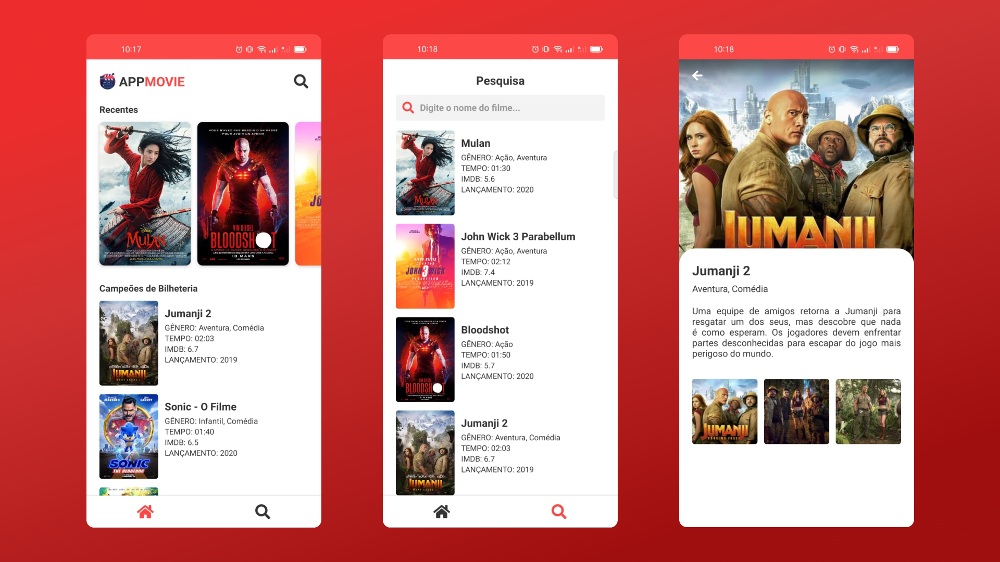

# APPMOVIE
> Apenas UI

Este Projeto consiste em um catálogo online de filmes

## Imagem



## Tecnologias Utilizadas
- React Native

## Link do Figma
- https://www.figma.com/file/4vh0ZwDXbr3TgfaV5IHxgW/APPMOVIE-FIRST-CLASS?node-id=0%3A1

## Como Usar
> Projeto nunca testado em IOS, pois só uso linux no momento 😅

Iniciar no android
- Execute o comando abaixo
```sh
cd mobile && yarn install && yarn android
```
